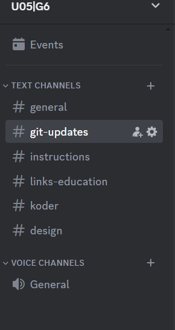

## Table of Contents
- [Intro](#intro)
- [Communication channels / Contract](#communication)
- [Design and Structure](#design)
- [Sprints / Daily notes](#sprints)

---

## Intro

Group 6 members: Denize, Denjin, Elias, Jacob, Sebah. We started the project by signing our contract, laying out the group members' responsibilities, requirements, and expectations. We discussed our end goal and established a daily schedule and timeline. In this document, we will share links related to documentation, design, and communication channels during the project.

We started the project by signing our contract. Which helped us lay the group members responsiblites, requirements and expectations. We discussed our goal at the end of the project and even set a daily schedule and timeplan. 
I this document we will be sharing the links related to documentation, design and communication channels during the project.

---

## Communication channels / Contract

- We have used discord as our main communication channel. We had a group were we shared tips, instructions, daily updates and github activities.

- Moreovere as stated above have we as well sat down and wrote our contract and signed as a group. 
[Contract Doc](https://docs.google.com/document/d/10IKQ9a1NHhIJJUe-Iqpym66g51a21CqkoGxUt3mVdbI/edit?usp=sharing)

---

## Design and Structure
- For our database structure and understanding, we used the Figma Projects [Fig Jam](https://www.figma.com/file/Mmx2g9kQwmqjFEJUEEelXI/U05_IMDb_Klon-ERD_Sitemap?type=whiteboard&t=apxBFbQt0IeUN6Tw-1) to visualize our ERD and Sitemaps. Moreover the have we used [Lucid Charts](https://www.lucidchart.com/) for our ERD.

- As for our low and high prototypes have we used [Figma](https://www.figma.com/file/F5yEJOMn965gSscTSkxvey/U05_IMDb_Klon?type=design&node-id=0-1&mode=design&t=wuGw36Fn0aLGh8Gt-0)

---

## Sprints / Daily notes

**Disclaimer:** The text below is summarized with the help of AI. For the full document written by Denize, Denjin, and Sebah, visit: [Google Doc/ Documentation](https://docs.google.com/document/d/1vUwvxp8LxeG6yFwYXpTV6CwTirsXCk5sahLya3pFvX8/edit?usp=sharing).
 
We decided on four main sprints where we discuss the content for the upcoming sprint by the end of the preceding one. We have meet almost daily, so we had regular sprint checkups.
1. Planing, Structure and DB setup.
2. DB setup, Design , Backend.
3. Backend and Deployment setup.
4. Backend and Tailwind.

**Friday 02/02/24:**
- All members present.
- Agenda: Contract signing, deciding on agile method, structuring work, discussing GitFlow, determining code standards, starting the project.
- Elias tasked with Tailwind documentation review over the weekend.
- Planned Monday meeting at 09:00 in school for GitHub flow overview and setting up devcontainer.

**Monday 05/02/23:**
- All present.
- Created dev-container with Laravel and database.
- Discussed blades, templates, ER-diagram, and site.map planning.
- Started working on Git issues, sitemaps, SQL tables, and ERD.

**Tuesday 6/2/2025:**
- Elias, Jacob, Sebah, and Denize present.
- Meeting with Olli-Heikki regarding database syncing and ERD.
- Agreed on work structure, documentation strategy, landing page structure, and design.
- Tasks distributed, including lo-fi and hi-fi prototypes.

**Thursday 8/2/2024:**
- All present except Denjin.
- Structured ER diagram, planned landing pages, and discussed database initialization.
- Summary of the week's work for Olli-Heikki.
- Started creating SQL tables, ERD, and sitemaps.

**Friday 9/2/2024:**
- Present: Denjin, Sebah, Denize, Jacob; Elias absent.
- Meeting with Olli-Heikki to review sitemap and ERD.
- Discussed database sync and effective approaches.
- Planned next steps and reading Laravel documentation.

**Monday 12/2/2024:**
- All present.
- Reviewed current status and next steps.
- Distributed tasks, including completing ER-diagram and creating tables.
- Started working on migrations and seeders.

**Tuesday 13/2/2024:**
- All present.
- Continued creating tables, migrations, and seeders.
- Started applying breeze and planning MVC structure.

**Thursday 15/02:**
- All present.
- Connected database to Aiven and worked on Vercel deployment.
- Met Olli-Heikki, discussed deployment, and planned controllers.

**Friday 16/2:**
- Present: Denjin, Jacob, Denize, Sebah; Elias absent.
- Fixed githooks, created pivot table migrations, and worked on models.
- Reviewed the week's progress and planned for the next sprint.

**Monday 19/2:**
- Present: Denjin, Jacob, Sebah, Elias; Denize absent.
- Focused on models and MVC structure.
- Prepared questions for meeting with Olli-Heikki.

**Tuesday 20/2:**
- All present.
- Continued working on models, controllers, and user authentication.

**Wednesday 21/2:**
- Present: Sebah, Denize, Jacob, Elias.
- Continued work on user authentication, data addition, Figma, and controllers.

**To be continued ...**

---
